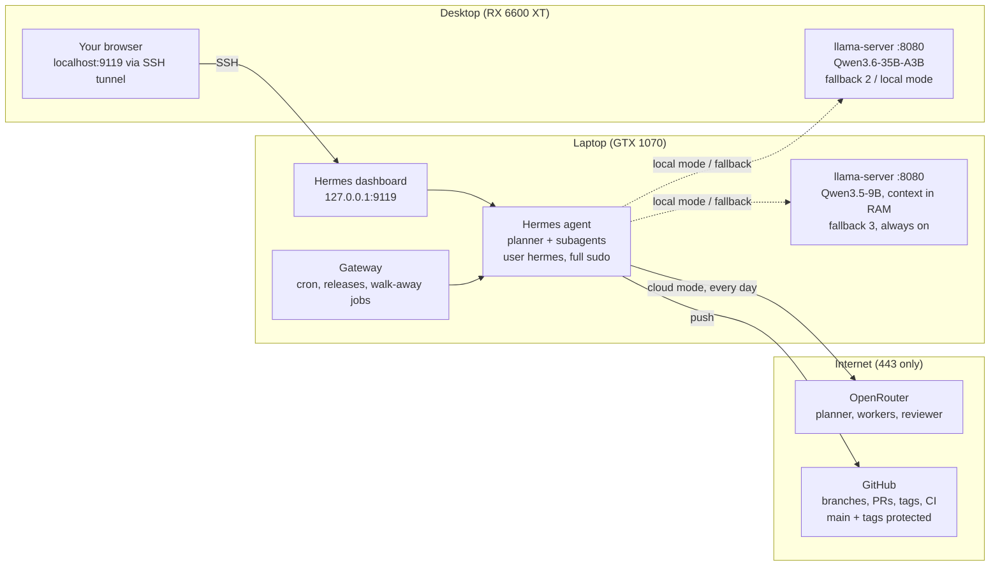

# Autonomous AI Node — Complete build: Hermes Agent, OpenRouter and local models

Oct 1, 2026 · @James

## What this builds

A headless Debian 13 laptop (GTX 1070, 8GB VRAM, 16GB RAM) runs **Hermes Agent**. It builds, tests and releases your code on GitHub, and you control it from a web page on your Windows desktop. OpenRouter is the default brain. Two local models back it up: Qwen3.6-35B-A3B on the desktop (RX 6600 XT, 8GB VRAM, 32GB RAM) when the desktop is on, and Qwen3.5-9B on the laptop at all times. One command switches between cloud and local, and the fallback chain switches on its own when the cloud fails.

This replaces every earlier part of the guide. Start from a fresh Debian 13 install on the laptop and a freshly reset Windows on the desktop.

**Priority: quality over speed, within limits.** Where a choice trades the two, this guide takes the higher-quality option as long as the agent stays usable for interactive work: larger quants, thinking on, higher reasoning effort, stronger worker models, and an independent review before every PR. Options that are better but too slow for interactive use (the dense Qwen3.8-27B) run only on unattended overnight jobs.

**Decisions at a glance:**

| Area | Choice | Why |
| --- | --- | --- |
| Agent | Hermes Agent, run by a dedicated `hermes` user with passwordless sudo and command approvals off | Subagents, cron, `/review` and a web dashboard are built in. The agent has full control of the laptop, as the OpenClaw plan intended. The safeguards that remain sit outside it: GitHub rules, the OpenRouter credit limit and your router. |
| Main brain | OpenRouter: frontier planner, strong workers, a reviewer from a different family, high reasoning effort | Hermes needs at least 64K tokens of context and reliable tool calls. Workers write most of the code, so they are not the cheapest model. |
| Local inference | llama.cpp `llama-server` on both machines | Lets you choose exactly what sits in VRAM and what sits in RAM. Ollama cannot place the context cache in RAM, and Hermes cannot set Ollama's context size through the API it uses. |
| Laptop model | Qwen3.5-9B, Unsloth `UD-Q5_K_XL`, thinking on, context cache in RAM. MiMo-V2.6-Distill-Qwen-9B as an A/B candidate | The best agentic model that fits 8GB. Only 8 of its 32 layers keep a context cache, so 128K tokens is affordable. |
| Desktop model | Qwen3.6-35B-A3B, Unsloth `UD-Q5_K_XL`, preserved thinking, experts in RAM | 3B active parameters per token keeps it fast with experts in RAM. 5-bit rather than 4-bit, because tool calling is the category most damaged by quantization for this model. |
| Overnight quality tier (optional) | Qwen3.8-27B on the desktop, for unattended jobs only | The strongest open model in reach. Too slow on 8GB of VRAM for interactive use. |
| Quantizations | Unsloth Dynamic GGUFs | On independent KL-divergence tests they sit on or near the best quality-for-size line for these models. |
| Review | A review subagent before every PR, plus `/review` | An independent check on every change, not only when you remember to ask. |
| Switching | `hermes-mode cloud`/`local`, `/model` in a session, automatic fallback | One command, one in-chat switch, and no action needed when the cloud fails. |
| GitHub | Machine account, fine-grained token, protected `main` and tags, releases from merged release PRs | The agent can build, test, tag and release, but cannot touch `main` directly or rewrite CI. |
| Control | Hermes dashboard on `127.0.0.1:9119`, reached by SSH tunnel | Its Chat tab is the full Hermes TUI in a browser. Nothing on the network can reach it directly. |

**Set expectations for local mode.** The desktop model is genuinely capable for agentic coding. The laptop model is a fallback: it keeps work moving when the cloud and the desktop are both unavailable, at lower quality. Unsloth helps quality in two ways, covered in Phase 9: its quantizations now, and optional fine-tuning later.

## How it fits together

The laptop holds the agent, its tools, the scheduler and the last-resort model. The desktop is your screen, plus the stronger local model when it is switched on. OpenRouter and GitHub are the only internet services the build depends on.



Fallback order: OpenRouter, then the desktop, then the laptop. `hermes-mode` switches whole modes.

Solid lines are the everyday path. Dashed lines carry traffic in local mode, or when the models before them fail.

**Addresses** — substitute your own:

| Machine or service | Address | Reachable from |
| --- | --- | --- |
| Laptop | `192.168.1.150` | Desktop, SSH only |
| Desktop | `192.168.1.100` | Not exposed, except its model port |
| Router / DNS | `192.168.1.1` | Everything |
| Hermes dashboard | `127.0.0.1:9119` on the laptop | The laptop, and you through the tunnel |
| Laptop model | `127.0.0.1:8080` on the laptop | The laptop only |
| Desktop model | `192.168.1.100:8080` | The laptop only, with an API key |

**Who does what:**

| Role | Cloud mode (default profile) | Local mode (`local` profile) |
| --- | --- | --- |
| Planner | Frontier OpenRouter coding model, high reasoning effort | Desktop `qwen3.6-35b-a3b`; laptop when the desktop is off; `qwen3.8-27b` for overnight jobs |
| Workers (subagents) | Strong mid-tier OpenRouter coding model | Laptop `qwen3.5-9b` |
| Reviewer (`/review` and the pre-PR review) | Frontier model from a different family | Same model as the planner |
| Fallback | Second OpenRouter model, then desktop, then laptop | Laptop |

## Phase 1 — Laptop operating system

### Step 1 — Install Debian 13 minimal

**Do:**

1. On the router, create DHCP reservations: laptop `192.168.1.150`, desktop `192.168.1.100`.
2. In the laptop's firmware, disable Secure Boot. This is a dedicated node, and it avoids signing the NVIDIA kernel module. If you must keep Secure Boot, see the note in Step 3. If the firmware has a "power on after AC loss" option, enable it.
3. Install from the Debian 13 netinst image. **Leave the root password empty.** The installer then installs `sudo` and adds your user to it. Create the user `ai-node` and set the hostname to `ai-node`. In software selection, tick only **SSH server** and **standard system utilities**, with no desktop environment.

   With no root password the root account is locked: `su` and `su -` fail with "Authentication failure", and root cannot log in over SSH. That is intended. For a root shell run `sudo -i`. (If you would rather have a root password, set one in the installer, but then it installs no `sudo` and does not add your user to it, and you must do both yourself as root: `apt install sudo` and `usermod -aG sudo ai-node`. Every later step assumes `sudo` works.)
4. Keep the lid open and the charger in until the next block is done. By default closing the lid suspends the laptop and drops your SSH session, which could be in the middle of an `apt` or driver build.

**Verify:** from the desktop, `ssh ai-node@192.168.1.150` logs in, and `sudo -v` asks for your password and accepts it.

**Do** (over SSH, straight after that first login, before Step 2): make the laptop ignore the lid and never suspend.

```bash
sudo mkdir -p /etc/systemd/logind.conf.d
printf '[Login]\nHandleLidSwitch=ignore\nHandleLidSwitchExternalPower=ignore\nHandleLidSwitchDocked=ignore\n' \
  | sudo tee /etc/systemd/logind.conf.d/lid.conf
sudo systemctl mask sleep.target suspend.target hibernate.target hybrid-sleep.target
sudo systemctl restart systemd-logind
```

**Verify:** close the lid for ten seconds and open it: the SSH session is still alive. The laptop can now live closed, on mains power, somewhere it can breathe.

### Step 2 — Enable non-free packages and update

**Do:**

```bash
if [ -f /etc/apt/sources.list.d/debian.sources ]; then
  # deb822 format
  sudo sed -i 's/^Components: .*/Components: main contrib non-free non-free-firmware/' \
    /etc/apt/sources.list.d/debian.sources
else
  # older one-line format
  sudo sed -i -E '/^deb /s/ main( .*)?$/ main contrib non-free non-free-firmware/' /etc/apt/sources.list
fi
sudo apt update && sudo apt full-upgrade -y
```

The installer writes either the newer deb822 file or the older one-line `sources.list`. The `if` handles both.

**Verify:** `apt policy nvidia-driver` shows a candidate version in the 550 series.

### Step 3 — NVIDIA driver for the GTX 1070

The GTX 1070 is a Pascal card. Debian 13's own 550 driver supports it. Newer drivers do not: NVIDIA's 590 branch and later dropped Pascal (580 was the last branch that supports it), and the open kernel modules never supported it.

Debian's 550 is an end-of-life branch with many CVEs unfixed in Debian (bug #1149642). This guide keeps the machine on the LAN only and treats a GPU-driver compromise as part of the agent's already-full control of the laptop. If you want security fixes, NVIDIA's 580 branch is the newest that supports Pascal, but installing it means leaving Debian's packages and changing the guard rails in `laptop/01-base-os.sh`.

**Do:**

```bash
sudo apt install -y linux-headers-amd64 nvidia-kernel-dkms nvidia-driver nvidia-smi \
  nvidia-persistenced firmware-misc-nonfree
sudo systemctl enable nvidia-persistenced
sudo reboot
```

**Verify:** `nvidia-smi` lists `GeForce GTX 1070` with about 8192MiB and a 550.x driver.

**Never** install `nvidia-open-kernel-dkms`, NVIDIA's own apt repository or its CUDA driver packages (they pull a branch without Pascal support), or a kernel from trixie-backports (6.16 and newer: the 550 module in trixie does not build on it, so DKMS fails and the GPU is gone after the reboot). Stay on the stock trixie kernel (6.12). The trixie-backports NVIDIA packages are the same 550 series, so there is no reason to use them.

**If you kept Secure Boot:** after the install, run `sudo mokutil --import /var/lib/dkms/mok.pub`, choose a one-time password, reboot, and enrol the key in the blue MOK screen.

**If `nvidia-smi` fails:** run `dkms status`. It must show `nvidia-current/550.163.01, <uname -r>, x86_64: installed` for the running kernel (`uname -r`). If that line is missing or says `built` or `added`, check that `ls /usr/src/linux-headers-$(uname -r)` exists, then run `sudo apt install --reinstall linux-headers-amd64 nvidia-kernel-dkms`. On a build error, read `/var/lib/dkms/nvidia-current/550.163.01/build/make.log`.

### Step 4 — Make the laptop behave like a server

**Do:**

The lid and sleep settings are already done (Step 1).

```bash
# Compressed swap in RAM, to absorb spikes from builds and tests
sudo apt install -y systemd-zram-generator
printf '[zram0]\nzram-size = ram / 2\ncompression-algorithm = zstd\n' | sudo tee /etc/systemd/zram-generator.conf
sudo systemctl daemon-reload && sudo systemctl start /dev/zram0

# Automatic security updates
sudo apt install -y unattended-upgrades
```

**Verify:** close the lid and the SSH session stays alive. `swapon --show` lists `/dev/zram0` at priority 100, about half your RAM in size (the `zram-size = ram / 2` above). Starting `systemd-zram-setup@zram0.service` is not enough: it only creates the device, and `/dev/zram0` is what turns the swap on.

Keep the laptop on mains power and somewhere it can breathe. Model inference holds the GPU at full load for minutes at a time.

### Step 5 — Key-only SSH from the desktop

**Do** (desktop, PowerShell):

```powershell
ssh-keygen -t ed25519
type $env:USERPROFILE\.ssh\id_ed25519.pub | ssh ai-node@192.168.1.150 "mkdir -p ~/.ssh && cat >> ~/.ssh/authorized_keys && chmod 600 ~/.ssh/authorized_keys"
```

Then on the laptop:

```bash
printf 'PasswordAuthentication no\nKbdInteractiveAuthentication no\nPermitRootLogin no\n' \
  | sudo tee /etc/ssh/sshd_config.d/10-hardening.conf
sudo systemctl reload ssh
```

**Verify:** open a **new** PowerShell window. `ssh ai-node@192.168.1.150` logs in without a password. Keep your existing session open until this works.

## Phase 2 — Agent user, tools and GitHub access

The agent runs as its own user, `hermes`, with passwordless sudo. That gives it full control of the laptop: packages, services, files and the firewall. A separate user still keeps the agent's config, keys and sessions apart from your admin account, and sudo logs every root command it runs (`journalctl _COMM=sudo`). `ai-node` stays your admin account.

### Step 6 — Create the agent user

**Do** (as `ai-node`):

```bash
sudo apt install -y systemd-container
sudo adduser --disabled-password --comment "" hermes
sudo loginctl enable-linger hermes

# Full control: passwordless sudo for the agent
# Check a temporary file first: a broken file in sudoers.d breaks sudo for everyone, and root has no password to fix it with
tmp=$(mktemp)
echo 'hermes ALL=(ALL:ALL) NOPASSWD: ALL' > "$tmp"
sudo visudo -cf "$tmp" && sudo install -m 440 -o root -g root "$tmp" /etc/sudoers.d/90-hermes
rm -f "$tmp"
sudo visudo -c                                # the whole configuration must say "parsed OK"
```

**Verify:** `sudo -u hermes sudo -n true && echo ROOT-OK` prints `ROOT-OK` with no password prompt. `loginctl show-user hermes -p Linger` prints `Linger=yes`.

**Always enter the agent user with `sudo machinectl shell hermes@`.** Hermes runs its gateway and dashboard as user services. Those need a real login session, which `sudo -iu hermes` does not create, so `systemctl --user` would fail with "Failed to connect to bus". Linger keeps those services running with nobody logged in, including after a reboot.

### Step 7 — Build tools, Node.js and the GitHub CLI

**Do** (as `ai-node`):

```bash
sudo apt install -y git build-essential cmake curl ca-certificates jq pciutils \
  python3 python3-venv python3-pip libcurl4-openssl-dev ufw

# Node.js 22: the dashboard's Chat tab runs the Hermes TUI, which needs it
curl -fsSL https://deb.nodesource.com/setup_22.x | sudo -E bash -
sudo apt install -y nodejs

# GitHub CLI from GitHub's own repository
sudo mkdir -p -m 755 /etc/apt/keyrings
curl -fsSL https://cli.github.com/packages/githubcli-archive-keyring.gpg \
  | sudo tee /etc/apt/keyrings/githubcli-archive-keyring.gpg >/dev/null
sudo chmod go+r /etc/apt/keyrings/githubcli-archive-keyring.gpg
echo "deb [arch=$(dpkg --print-architecture) signed-by=/etc/apt/keyrings/githubcli-archive-keyring.gpg] https://cli.github.com/packages stable main" \
  | sudo tee /etc/apt/sources.list.d/github-cli.list >/dev/null
sudo apt update && sudo apt install -y gh
```

Also install the toolchains your projects need to build, test and package: language runtimes, compilers, databases for integration tests. The agent can install anything else itself with `sudo apt`, and `AGENTS.md` (Step 24) asks it to list each package in the PR. If your projects build or test in containers, install Docker and add `hermes` to the `docker` group.

**Verify:** `node -v` shows v22 or later, and `gh --version` and `git --version` both print.

### Step 8 — Give the agent scoped GitHub access

The agent pushes branches, opens pull requests, and creates tags and releases. You merge. It never pushes to `main`, never moves or deletes a release tag, and cannot edit CI workflows.

**Do, on GitHub:**

1. **Create a machine account** (for example `yourorg-hermes`) and add it to each repo with Write access. GitHub allows one machine account per person. GitHub will not let you approve a PR your own account opened, so a separate account keeps the agent's PRs reviewable.
2. **Protect `main`:** Settings → Rules → Rulesets → New branch ruleset, targeting the default branch. Enable "Require a pull request before merging", "Require status checks to pass" (once CI exists), "Block force pushes" and "Restrict deletions".
3. **Protect release tags:** New tag ruleset, targeting `v*`. Enable "Restrict updates" and "Restrict deletions". Leave creation allowed, so the agent can create a new tag but can never move or remove a published one.
4. **As the machine account, create a fine-grained token:** Settings → Developer settings → Fine-grained tokens, "Only select repositories", 90-day expiry.

| Permission | Access | Why |
| --- | --- | --- |
| Contents | Read and write | Clone, commit, push branches, create tags and releases |
| Pull requests | Read and write | Open and update PRs |
| Issues | Read and write | Read issues, comment on them |
| Actions | Read | Watch CI runs |
| Commit statuses | Read | See check results |
| Metadata | Read | Required, added automatically |

**Do not grant** Workflows, Administration, Secrets or Environments. Without Workflows, GitHub rejects any push that changes `.github/workflows/`. The agent cannot rewrite CI to skip tests or leak secrets.

**Do, on the laptop:**

```bash
sudo machinectl shell hermes@
# inside the hermes session:
read -rs T && echo "$T" | gh auth login --with-token && unset T
gh auth setup-git
git config --global user.name  "yourorg-hermes"
git config --global user.email "<id>+yourorg-hermes@users.noreply.github.com"
mkdir -p ~/repos && cd ~/repos && gh repo clone yourorg/yourrepo
echo ".worktrees/" >> yourrepo/.git/info/exclude
```

The noreply address is under the machine account's Settings → Emails. The last line keeps the subagents' git worktrees (Phase 3) out of commits.

**Verify** (in `~/repos/yourrepo`):

```bash
gh auth status                                   # logged in as yourorg-hermes
git switch -c hermes/smoke && git commit --allow-empty -m "smoke test"
git push -u origin hermes/smoke                  # works
git push origin HEAD:main                        # must be REJECTED
git tag v0.0.0-smoke && git push origin v0.0.0-smoke   # works
git push origin :refs/tags/v0.0.0-smoke          # must be REJECTED
```

Then remove the test tag and branch in the GitHub web UI. On the tag ruleset, add yourself (or repository admins) as a bypass actor first, or the ruleset blocks you too.

**If either push that should fail succeeds,** the matching ruleset is not active or does not target the right branch or tag pattern. Fix it before continuing.

## Phase 3 — Hermes on OpenRouter

Get one clean cloud-backed conversation working before adding anything else.

### Step 9 — Install Hermes

**Do** (as `hermes`, via `sudo machinectl shell hermes@`):

```bash
curl -fsSL https://hermes-agent.nousresearch.com/install.sh | bash
source ~/.bashrc
hermes doctor
```

**Verify:** `command -v hermes` prints a path. Note it, because Phase 4 uses it. `hermes doctor` reports nothing worse than "no provider configured".

### Step 10 — Connect OpenRouter

**Do, on openrouter.ai:** create a key just for this machine and give it a **credit limit**, sized to your budget. Strong models at high reasoning effort cost noticeably more, so start around $50 a month and adjust after a week of Analytics. An unattended agent running subagents can spend a lot in one bad loop, and the key limit is a hard stop. Under privacy settings, block providers that train on your prompts.

**Do, on the laptop:** run `hermes model`, choose OpenRouter, paste the key and pick the main (planner) model from the live list. Choose a strong agentic coding model. Model names on OpenRouter change often, so this guide does not hard-code them.

**Verify:** `cd ~/repos/yourrepo && hermes --tui`, then ask *"Summarise this repo in five bullets and tell me how to run its tests."* It should open files with tools, not guess. Quit, run `hermes -c`, and confirm the same session returns.

### Step 11 — Set the roles: planner, workers, reviewer

The planner splits work. Subagents (workers) carry out well-specified pieces and use most of the tokens. The reviewer checks finished work. **Quality first:** give workers a strong mid-tier agentic coder rather than the cheapest model, because they write most of the code. Give the reviewer a frontier model from a **different family** than the planner, so it does not share the planner's blind spots. Current open-weight candidates include Xiaomi's MiMo-V2.6 Pro (planner) and Flash (workers), and Z.ai's GLM-5.3 (reviewer). Confirm which are listed in `hermes model` before using them.

**Do:** add to `~/.hermes/config.yaml`, replacing the `<...>` placeholders with model IDs from `hermes model`:

```yaml
terminal:
  backend: local                 # runs as the hermes user
  cwd: /home/hermes/repos

agent:
  reasoning_effort: high         # planner thinks harder; costs more tokens

delegation:
  provider: openrouter
  model: "<strong mid-tier agentic coder>"
  max_concurrent_children: 3     # default 10; 3 keeps spend predictable
  max_iterations: 200
  worktree_isolation: true       # each subagent works on its own branch and worktree

auxiliary:
  review:
    provider: openrouter
    model: "<frontier model, different family from the planner>"
  compression:
    provider: openrouter
    model: "<capable mid-tier model>"   # a weak summariser loses detail in long sessions

provider_routing:
  data_collection: "deny"        # skip OpenRouter providers that may store or train on data
```

Worktree isolation gives each subagent a branch `hermes-subagent/<id>` under `<repo>/.worktrees/`, so parallel workers never overwrite each other. It only works with the local terminal backend, which is one reason the agent does not run inside Docker.

Once the dashboard is up (Phase 4), open Config and set the dangerous-command **approval mode to off**. The agent then runs every command, including `sudo`, without asking, in chat sessions, subagents and cron runs alike. Unattended jobs never stall waiting for an approval nobody will give. Set it back to smart if you ever want a check before risky commands.

### Step 12 — Prove subagents and review

**Do:** in a test repo, ask *"Use subagents in parallel: one adds a `--version` flag, one adds a test for the config loader. Run the tests, merge both into a branch `hermes/demo` and push it."* Press **Ctrl+T** in the TUI to watch the workers. When it finishes, type `/review`.

**Verify:**

- Two `hermes-subagent/...` branches appeared, and the main checkout stayed clean while they worked.
- `hermes/demo` is on GitHub, and nothing was merged into `main`.
- The `/review` result came back into the same chat and refers to the real diff and test output.

**If subagents edited the main checkout:** worktree isolation falls back silently when the backend is not `local` or Hermes was not started inside a git repo.

## Phase 4 — Web control from the desktop

The Hermes dashboard is the control page. Its **Chat** tab runs the full Hermes TUI in the browser: slash commands, model picker, subagent monitor and approval prompts. A session list and workspace picker sit beside it. Other tabs cover sessions, logs, cost analytics, cron, skills, MCP and config. It listens only on the laptop's loopback address, and you reach it through an SSH tunnel.

### Step 13 — Run the gateway as a service

The gateway fires cron jobs and runs unattended work. Without it, schedules never run.

**Do** (as `hermes`):

```bash
hermes gateway install
hermes gateway status
hermes cron status
```

**Verify:** the gateway shows running, and `hermes cron status` reports a recent scheduler tick.

### Step 14 — Run the dashboard as a service

**Do** (as `hermes`): create `~/.config/systemd/user/hermes-dashboard.service`. Use the path that `command -v hermes` printed in Step 9:

```ini
[Unit]
Description=Hermes web dashboard
After=network-online.target

[Service]
ExecStart=/home/hermes/.local/bin/hermes dashboard --host 127.0.0.1 --port 9119 --no-open
Restart=always
RestartSec=10
# exit 78 = another dashboard already owns this host; don't restart-loop on it
RestartPreventExitStatus=78

[Install]
WantedBy=default.target
```

```bash
systemctl --user daemon-reload
systemctl --user enable --now hermes-dashboard
```

**Verify:**

```bash
curl -s http://127.0.0.1:9119/api/status | jq '.auth_required'   # false
ss -tlnp | grep 9119                                             # 127.0.0.1:9119 only
```

The first start takes a minute while it builds the web frontend. On loopback the dashboard needs no login. That is safe only because nothing else can reach it, and anyone who can open this page controls an agent with root on the laptop. Never bind it to another address without the dashboard's password protection.

### Step 15 — Open it from the desktop

**Do** (desktop): save this as `hermes-tunnel.cmd` on the desktop and pin it to the taskbar:

```bat
ssh -N -o ServerAliveInterval=30 -o ExitOnForwardFailure=yes -L 9119:127.0.0.1:9119 ai-node@192.168.1.150
```

Run it, then browse to `http://localhost:9119`.

**Use port 9119 on both ends.** The dashboard checks the browser's Host header to block DNS-rebinding attacks, and a tunnel on a different local port can be refused even though the tunnel itself works.

**Verify:**

- The Status page shows the gateway running.
- **Chat** opens a working Hermes session. The workspace picker can start it in `~/repos/yourrepo`.
- From a phone on the same Wi-Fi, `http://192.168.1.150:9119` does **not** load.

**Interactive and walk-away work run differently.** A Chat session lives as long as its browser tab. Closing the tab ends the session and stops its background subagents. Anything you want to leave running goes to the gateway as a cron job (Phase 7).

## Phase 5 — Local models

Both machines run `llama-server` from llama.cpp, which speaks the same API as OpenRouter. The laptop keeps its model's weights in VRAM and its context cache in RAM. The desktop keeps attention and the context cache in VRAM, and the bulk of its weights, the mixture-of-experts layers, in its 32GB of RAM.

### Step 16 — The model and quantization picks

Researched October 2026 on Hugging Face, Unsloth's benchmarks and independent quantization tests (sources at the end).

| Node | Model | Quant | File | Where it lives | Context | Why |
| --- | --- | --- | --- | --- | --- | --- |
| Laptop | Qwen3.5-9B | Unsloth `UD-Q5_K_XL` | 6.74GB | Weights in VRAM; context cache in RAM | 128K | The standard pick for 8GB cards. Strong tool calling for its size (BFCL-V4 66.1, TAU2-Bench 79.1). |
| Laptop, A/B candidate | MiMo-V2.6-Distill-Qwen-9B | bartowski `Q5_K_M` | 6.88GB | Same | Check 64K or more works | Qwen3.5-9B fine-tuned on Xiaomi MiMo data. Xiaomi reports MiMo Code (mini) rising from 19.5 to 51.6. It is a research release with its own chat template, so deploy only if it wins your Step 30 tests. |
| Laptop, if Q5 does not fit | Qwen3.5-9B | Unsloth `UD-Q4_K_XL` | 5.97GB | Same | 128K | Use only if Q5 runs out of VRAM. |
| Desktop | Qwen3.6-35B-A3B | Unsloth `UD-Q5_K_XL` | 26.6GB | Attention and context in VRAM; experts in RAM | 128K | 35B total, 3B active per token, so it stays fast with experts in RAM. SWE-bench Verified 73.4, Terminal-Bench 2.0 51.5. 5-bit protects tool calling. |
| Desktop, if RAM is tight | Qwen3.6-35B-A3B | Unsloth `UD-Q4_K_XL` | 22.4GB | Same | 128K | Use if Windows memory runs above about 90%, or the disk is busy during generation. |
| Desktop, overnight (optional) | Qwen3.8-27B | Unsloth `UD-Q4_K_XL` | 17.2GB | Split between VRAM and RAM | 128K | SWE-bench Pro 61.7, against 49.5 for Qwen3.6-35B-A3B. Dense, so slow here; unattended jobs only (Phase 9). |

**Why 128K, not 64K.** Hermes requires at least 64K. Qwen advises at least 128K to keep the models' reasoning intact. Both models use a hybrid design, where only one layer in four keeps a growing context cache, so 128K is affordable on both machines.

**Considered and not chosen:**

- **Qwen3.8-27B** is the strongest open model that runs here (SWE-bench Pro 61.7). It is dense, though: at `UD-Q4_K_XL` (17.2GB), about half its layers would run from desktop RAM on every token, which typically means a few tokens per second. It is therefore set up as an optional overnight tier in Phase 9, not as the interactive model.
- **Gemma 4 12B** has a larger context cache (about 2.3GiB at only 32K tokens), so it cannot reach Hermes's 64K minimum on an 8GB card. A third-party comparison also found it weaker than Qwen3.5-9B at agentic bug-fixing.
- **Qwen-AgentWorld-35B-A3B** is an environment simulator for training agents, not a model for driving one.
- **3-bit quants of the 35B model.** Independent tests found tool calling is the category most damaged by quantization for this model. Stay at 4-bit or above.

### Step 17 — Build llama.cpp on the laptop

Debian 13's CUDA 12.4 toolkit pairs with the 550 driver and still supports Pascal (compute capability 6.1). CUDA 13 does not, so do not install it.

**Do** (as `ai-node`):

```bash
sudo apt install -y nvidia-cuda-toolkit g++-13
nvcc --version                      # release 12.4

git clone https://github.com/ggml-org/llama.cpp ~/src/llama.cpp && cd ~/src/llama.cpp
cmake -B build -DGGML_CUDA=ON -DCMAKE_CUDA_ARCHITECTURES=61 \
  -DCMAKE_CUDA_HOST_COMPILER=g++-13 -DBUILD_SHARED_LIBS=OFF -DCMAKE_BUILD_TYPE=Release
cmake --build build -j"$(nproc)" --target llama-server llama-bench llama-cli
sudo install -d /opt/llama.cpp/bin
sudo install -m 755 build/bin/llama-server build/bin/llama-bench build/bin/llama-cli /opt/llama.cpp/bin/
```

**Verify:** `/opt/llama.cpp/bin/llama-server --version` prints a build number and finds `GTX 1070, compute capability 6.1`.

**If CUDA will not build:** use Vulkan instead. Run `sudo apt install libvulkan-dev glslc nvidia-vulkan-icd` and replace the three CUDA flags with `-DGGML_VULKAN=ON`. It is usually a little slower on Pascal. One known cause: errors mentioning `sinpi`, `cospi` or `rsqrt` with "exception specification is incompatible" come from CUDA 12.x headers clashing with newer glibc math headers. Vulkan avoids that clash entirely.

**Updating:** `git pull`, re-run the two `cmake` lines and the `install` line, then restart the service. These models are recent, so stay current.

### Step 18 — Laptop model and service

**Do:**

```bash
sudo adduser --system --group --home /srv/llm llm
sudo install -d -o llm -g llm /srv/models /srv/llm/slots
# Check the exact file name on the repo's "Files" tab if this 404s
sudo -u llm curl -L -o /srv/models/Qwen3.5-9B-UD-Q5_K_XL.gguf \
  https://huggingface.co/unsloth/Qwen3.5-9B-GGUF/resolve/main/Qwen3.5-9B-UD-Q5_K_XL.gguf

# Measure: context cache in VRAM (-nkvo 0) against in RAM (-nkvo 1), empty and 32K deep
/opt/llama.cpp/bin/llama-bench -m /srv/models/Qwen3.5-9B-UD-Q5_K_XL.gguf \
  -ngl 99 -fa 1 -ctk f16 -ctv q8_0 -nkvo 0,1 -d 0,32768 -p 2048 -n 128
```

The benchmark shows the trade-off. With Q5 weights the cache usually only fits in RAM, and that is the layout below. If a cache-in-VRAM row runs much faster and you prefer speed, switch to `UD-Q4_K_XL` and drop `-nkvo`. Skip the `mmproj` vision file, which would cost VRAM the agent does not need.

Create `/etc/systemd/system/llama-server.service`:

```ini
[Unit]
Description=llama-server (Qwen3.5-9B)
After=network-online.target

[Service]
User=llm
ExecStart=/opt/llama.cpp/bin/llama-server \
  -m /srv/models/Qwen3.5-9B-UD-Q5_K_XL.gguf --alias qwen3.5-9b \
  --host 127.0.0.1 --port 8080 --jinja -ngl 99 -fa on -np 1 \
  -c 131072 -nkvo -ctk f16 -ctv q8_0 \
  --cache-ram 2048 --slot-save-path /srv/llm/slots \
  --chat-template-kwargs '{"enable_thinking":true}' \
  --temp 0.6 --top-p 0.95 --top-k 20 --min-p 0 --presence-penalty 0
Restart=on-failure
RestartSec=5

[Install]
WantedBy=multi-user.target
```

```bash
sudo systemctl daemon-reload && sudo systemctl enable --now llama-server
```

**What the flags do:**

- `--jinja` is required for tool calls. Without it the model writes tool calls as plain text.
- `-np 1` gives one slot holding the whole context. More slots split `-c` between them.
- `-nkvo` keeps the context cache in RAM. Keys stay at 16-bit, where quantization costs the most quality, and values at 8-bit. That is about 3GB of RAM at 128K.
- `--cache-ram 2048` keeps recent prompts warm in RAM, so switching sessions does not re-read everything. The default is 8GB, which is too much for 16GB of RAM.
- Qwen3.5's small models do not think unless asked. `enable_thinking` turns thinking on, and the sampling values are Qwen's recommendation for thinking mode on precise coding work. Turns get slower but stronger on hard steps.

**Verify:** `nvidia-smi` shows about 7GB used. If the service fails with a CUDA out-of-memory error, switch to `UD-Q4_K_XL`.

### Step 19 — Desktop model and service (Windows)

The desktop has an AMD card, so it uses llama.cpp's Vulkan build. That needs no CUDA or ROCm.

**Do:**

1. Install the current AMD Adrenalin driver.
2. From github.com/ggml-org/llama.cpp/releases, download the latest `llama-<build>-bin-win-vulkan-x64.zip` and extract it to `C:\llama`. Check that `C:\llama\llama-cli.exe --list-devices` lists the RX 6600 XT.
3. Download the model (26.6GB):

```powershell
mkdir C:\models
# 26.6GB; check the exact file name on the repo's Files tab if this 404s
curl.exe -L -o C:\models\Qwen3.6-35B-A3B-UD-Q5_K_XL.gguf https://huggingface.co/unsloth/Qwen3.6-35B-A3B-GGUF/resolve/main/Qwen3.6-35B-A3B-UD-Q5_K_XL.gguf
```

4. Make an API key. This server listens on the LAN, so it gets a password even though the firewall already limits it to the laptop. Run `[Convert]::ToBase64String((1..32 | % { Get-Random -Max 256 }))` and keep the output.
5. Create `C:\llama\start-llama.cmd`:

```bat
C:\llama\llama-server.exe -m C:\models\Qwen3.6-35B-A3B-UD-Q5_K_XL.gguf --alias qwen3.6-35b-a3b ^
  --host 192.168.1.100 --port 8080 --api-key PASTE_KEY_HERE ^
  --jinja -ngl 99 --n-cpu-moe 40 -fa on -np 1 -c 131072 -ctk f16 -ctv q8_0 ^
  --cache-ram 1024 --chat-template-kwargs "{\"preserve_thinking\":true}" ^
  --temp 0.6 --top-p 0.95 --top-k 20 --min-p 0 --presence-penalty 0
```

6. Allow only the laptop in, in an administrator PowerShell:

```powershell
New-NetFirewallRule -DisplayName "llama-server 8080 (laptop only)" -Direction Inbound -Protocol TCP -LocalPort 8080 -Action Allow -RemoteAddress 192.168.1.150
```

7. Start it at logon, from an administrator PowerShell: `schtasks /create /tn llama-server /tr C:\llama\start-llama.cmd /sc onlogon /rl highest`

**Tune the expert split.** `--n-cpu-moe 40` keeps the experts of all 40 layers in RAM, which is the safe starting point. Recent llama.cpp builds include `llama-fit-params`, which probes free VRAM and prints placement flags without starting the server. If `C:\llama\llama-fit-params.exe` exists, run it with the same model and `-c` and use what it suggests. Otherwise tune by hand: open Task Manager → Performance → GPU, note **Dedicated GPU memory**, and lower the number step by step (32, 28, 24...) until it sits at about 7.3GB. Each layer moved back to the GPU adds roughly 0.6GB at Q5 and speeds up generation.

**Check the RAM side too.** At Q5 the desktop's 32GB is close to full. While a long answer generates, Task Manager → Memory should stay under about 90%, and the disk should stay quiet. If either fails, switch to `UD-Q4_K_XL` (22.4GB). A model paging from disk is far slower than the small quality gain is worth.

**Thinking and sampling.** Qwen3.6 thinks before answering by default, and the sampling values are Qwen's recommendation for thinking mode on precise coding work. `preserve_thinking` keeps the model's earlier reasoning in context, which Qwen trained 3.6 to use. It costs extra tokens, but makes long agent sessions more consistent. Keys stay at 16-bit and values at 8-bit, for the same reason as on the laptop.

**When the desktop is off or asleep,** Hermes falls back to the laptop on its own (Phase 6). To keep the desktop model available, set Windows sleep to Never while on mains power. Overnight jobs (Step 31) wake it with a timer instead.

**If the server fails with `-fa on` or the `q8_0` value cache:** your Vulkan build lacks that combination for this card. Remove `-ctv q8_0` first, then `-fa on` if needed. A full 16-bit cache is about 2.5GB at 128K, which may need one more expert layer moved to RAM.

### Step 20 — Check both endpoints from the laptop

**Do** (laptop):

```bash
curl -s http://127.0.0.1:8080/v1/models | jq -r '.data[].id'                     # qwen3.5-9b
curl -s -H "Authorization: Bearer <key>" http://192.168.1.100:8080/v1/models \
  | jq -r '.data[].id'                                                             # qwen3.6-35b-a3b

# Tool-call smoke test: must return a get_weather call, not prose
curl -s http://127.0.0.1:8080/v1/chat/completions -H 'Content-Type: application/json' -d '{
  "model":"qwen3.5-9b","messages":[{"role":"user","content":"Weather in Paris?"}],
  "tools":[{"type":"function","function":{"name":"get_weather","parameters":{"type":"object",
  "properties":{"city":{"type":"string"}},"required":["city"]}}}]}' | jq '.choices[0].message.tool_calls'
```

Run the smoke test against the desktop too, with its address, model name and the `Authorization` header.

## Phase 6 — Switching between OpenRouter and local

There are three ways to switch, from automatic to deliberate:

| Way | How | Scope | Use it when |
| --- | --- | --- | --- |
| Automatic fallback | Nothing to do | Per turn | OpenRouter or a model fails. A model further down the chain answers that turn. |
| In-session switch | `/model` in Chat, or the model picker in the Chat sidebar | One session, from its next turn | You want the desktop model for one task, or the cloud for one hard step |
| Mode switch | `hermes-mode cloud` or `hermes-mode local` | New CLI sessions | Going offline, saving credit, or keeping code private |

### Step 21 — Name the local endpoints and build the fallback chain

**Do** (as `hermes`): store the desktop key, then add the endpoints and the chain to `~/.hermes/config.yaml`:

```bash
echo 'DESKTOP_LLM_KEY=<the key from Step 19>' >> ~/.hermes/.env
chmod 600 ~/.hermes/.env
```

```yaml
providers:
  laptop:
    api: http://127.0.0.1:8080/v1
    default_model: qwen3.5-9b
    context_length: 131072
  desktop:
    api: http://192.168.1.100:8080/v1
    key_env: DESKTOP_LLM_KEY
    default_model: qwen3.6-35b-a3b
    context_length: 131072

fallback_providers:
  - provider: openrouter
    model: "<a second OpenRouter model from a different upstream company>"
  - provider: custom:desktop
    model: qwen3.6-35b-a3b
  - provider: custom:laptop
    model: qwen3.5-9b
```

The chain is meant to cover three failures: one upstream model being overloaded, OpenRouter itself being unreachable, and the desktop being asleep. Fallback works per turn. Each new message tries OpenRouter first again, and every switch resets the prompt cache, so a session that keeps bouncing costs more. Hermes's documentation does not settle whether one turn can walk past more than one failing entry, so Step 29 tests it.

**Verify:** `hermes fallback list` shows the three entries in order. In a chat, `/model custom:desktop:qwen3.6-35b-a3b` switches to the desktop and the next answer comes from it.

### Step 22 — Create the `local` profile

A profile is a separate Hermes home with its own config, keys, memory and sessions. The `local` profile never touches the cloud. The desktop model plans and reviews, the laptop model runs subagents, and the laptop takes over planning when the desktop is off.

**Do:**

```bash
hermes profile create local --clone
```

Edit `~/.hermes/profiles/local/config.yaml` so these keys read:

```yaml
model:
  provider: custom:desktop
  default: qwen3.6-35b-a3b

fallback_providers:
  - provider: custom:laptop
    model: qwen3.5-9b

delegation:
  base_url: http://127.0.0.1:8080/v1   # subagents on the laptop's 9B
  model: qwen3.5-9b
  api_key: local
  max_concurrent_children: 1           # one slot per GPU; more would only queue

auxiliary:
  review:      { provider: main }      # /review on the desktop model
  compression: { provider: main }
```

The clone copies your cloud settings, so also delete the `provider: openrouter` line inside `delegation:`. The `base_url` above sends subagents to the laptop, and a leftover provider line can make Hermes look for OpenRouter credentials. Then remove the `OPENROUTER_API_KEY` line from `~/.hermes/profiles/local/.env`, and keep `DESKTOP_LLM_KEY`. Nothing in this profile can reach the cloud.

**Trim its tools:** run `local tools` and turn off browser, image generation, voice and web search. Each enabled toolset adds its definitions to every request, and reading the prompt is the slow part on these GPUs.

### Step 23 — One command to switch modes

**Do** (as `hermes`): create `~/.local/bin/hermes-mode` and run `chmod +x ~/.local/bin/hermes-mode`:

```bash
#!/usr/bin/env bash
# hermes-mode [cloud|local|status] - switch the default Hermes profile and show what is reachable
set -uo pipefail
KEY=$(grep -E '^DESKTOP_LLM_KEY=' ~/.hermes/.env | cut -d= -f2- | tr -d "'\"")
probe() { curl -s -m 3 -o /dev/null -w '%{http_code}' "$@" || true; }
case "${1:-status}" in
  cloud) hermes profile use default ;;
  local) hermes profile use local ;;
  status) ;;
  *) echo "usage: hermes-mode [cloud|local|status]"; exit 2 ;;
esac
echo "laptop  qwen3.5-9b      : $(probe http://127.0.0.1:8080/health)"
echo "desktop qwen3.6-35b-a3b : $(probe -H "Authorization: Bearer $KEY" http://192.168.1.100:8080/health)"
echo "openrouter              : $(probe https://openrouter.ai/api/v1/models)"
hermes profile list
```

`200` means up, and `000` means unreachable. Run it over SSH, or ask Hermes to run it from Chat.

**How the mode reaches each place:**

- **The CLI and TUI** (`hermes`, `hermes chat`, `hermes --tui`) follow the sticky profile that `hermes-mode` sets.
- **The dashboard's Chat** follows the profile switcher in its sidebar, independently of the sticky setting. Pick `local` there for a local Chat session.
- **Scheduled jobs** always run in the profile they were created in, on that profile's gateway. Jobs in the default profile already fall back to local. For a job that must never use the cloud, create it with `local cron create`, after running `local gateway install` once (Step 31 does this).

**Verify:** `hermes-mode local`, then `hermes chat -q "Which model are you?"` answers from `qwen3.6-35b-a3b`. Turn the desktop off and ask again: the answer comes from `qwen3.5-9b` after a short retry. Check that the gateways were not affected: `hermes -p default cron list` still lists the default profile's jobs. Then `hermes-mode cloud` switches back.

**If the default gateway starts serving the `local` profile** after a restart in local mode, your Hermes version applies the sticky profile to services too. Leave the mode on `cloud`, and use `local chat` or the dashboard's profile switcher for local work instead.

## Phase 7 — Build, test and release on GitHub

The lifecycle has one human gate per change: you merge. The agent does everything before the merge (branch, build, test, PR) and everything after a release PR merges (tag, watch CI, verify the release).

1. The agent works on `hermes/<topic>`, builds, runs the full tests and opens a PR.
2. CI tests the PR, `/review` checks it, and you merge.
3. To release, `/release <version>` opens a release PR with the version bump and changelog.
4. You merge the release PR.
5. The agent tags the merge commit, the tag triggers the CI release workflow, and the agent confirms the published release.

### Step 24 — Write each repo's rules

Every session and every subagent loads `AGENTS.md` from the repo root automatically. **Do:** commit one per repo, adjusted to the project:

```markdown
# Agent rules for this repo

## Build and test
- Install: `<npm ci | pip install -e .[dev] | ...>`
- Test (must pass before any push): `<npm test | pytest -q | ...>`
- Lint: `<npm run lint | ruff check . | ...>`
- Package (what CI publishes): `<make dist | npm pack | python -m build>` -> `dist/`

## Git
- Never commit to or push `main`. Work on `hermes/<short-topic>` branches.
- One logical change per branch. Rebase on `origin/main` before pushing.
- Before opening a PR, delegate an independent review of the full diff to a
  subagent, giving it the task, this file and the test output. Fix what it finds,
  re-run the tests, and summarise the review in the PR body.
- Open PRs with `gh pr create`. Body: what changed, why, the test output and the review summary.
- Use `--draft` unless all tests pass locally.
- Never edit `.github/workflows/`. The token cannot push those changes.

## Releases
- Version lives in: `<package.json | pyproject.toml | VERSION>`
- Changelog: `CHANGELOG.md`, newest section first.
- Semantic versioning. Tags are `vX.Y.Z` on the release PR's merge commit.
- Never delete or move a tag. Fix mistakes with a new patch release.

## Machine and boundaries
- You have passwordless sudo on this laptop. Install missing system packages with
  `sudo apt install`, and list each one in the PR body so the setup stays reproducible.
- Do not add project dependencies without saying why in the PR.
- Secrets never go in code, logs or PR text.
```

**Verify:** in a new session, ask *"What are your rules for releasing this repo?"* It answers without opening the file, because the file is already in its context.

### Step 25 — Add a `/release` skill

A skill is a `SKILL.md` file of instructions that Hermes loads on demand. Every installed skill becomes a slash command.

**Do** (as `hermes`): create `~/.hermes/skills/release/SKILL.md`, then copy the folder to `~/.hermes/profiles/local/skills/` so local mode has it too:

```markdown
---
name: release
description: Cut a versioned release of the current repo. Stage 1 opens a release PR with the version bump and changelog. Stage 2 tags the merged PR and verifies the GitHub release.
---
# Release

Input: a version such as 1.4.0, without the v. If none is given, propose one from the commits since the last tag (semantic versioning) and ask.

First check: if a PR titled "Release v<version>" is already merged and the tag v<version> does not exist, go straight to Stage 2.

## Stage 1: release PR
1. git fetch --tags origin, switch to main, pull with --ff-only.
2. Read AGENTS.md for the version file, changelog and the build, test and package commands. Run the full test suite. Stop and report if it fails.
3. Create branch hermes/release-<version>. Bump the version. Add a CHANGELOG.md section summarising changes since the last tag (git log <last-tag>..HEAD --oneline, and merged PR titles from gh pr list).
4. Run the package command to prove the release artifacts build.
5. Push, then open a PR titled "Release v<version>" with the changelog section as its body. Report the PR link and stop. Never merge it yourself.

## Stage 2: tag and release
1. Confirm the PR is merged: gh pr view <number> --json state,mergeCommit.
2. git fetch origin, then tag the merge commit: git tag -a v<version> <merge sha> -m "v<version>", and git push origin v<version>.
3. If .github/workflows/release.yml exists, find its run with gh run list --workflow release.yml -L 1, wait with gh run watch, and report the outcome.
4. If there is no release workflow, run gh release create v<version> --verify-tag --title "v<version>" --notes-file <the changelog section> with the artifacts from the package command.
5. Finish by checking gh release view v<version> and report its URL and assets.
6. Never delete or move a tag. If something is wrong, release the next patch version.
```

**Verify:** in Chat, type `/release` in a test repo. It proposes a version from recent commits and asks before doing anything.

### Step 26 — Add the CI workflows yourself

The agent's token cannot write workflow files, so you add them, once per repo. CI then builds release artifacts from a clean machine with the repo's own secrets, and the agent never sees those secrets.

**Do:** commit `.github/workflows/test.yml` (runs on every PR) and `.github/workflows/release.yml`. Then add the test job as a required status check on the `main` ruleset from Step 8.

```yaml
# .github/workflows/release.yml - runs when the agent pushes a vX.Y.Z tag
name: release
on:
  push:
    tags: ['v*']
permissions:
  contents: write
jobs:
  release:
    runs-on: ubuntu-latest
    steps:
      - uses: actions/checkout@v4
      - run: make test            # your test command
      - run: make dist            # your package command, output in dist/
      - name: Publish
        env:
          GH_TOKEN: ${{ github.token }}
        run: |
          gh release create "$GITHUB_REF_NAME" dist/* --verify-tag --generate-notes \
            || gh release upload "$GITHUB_REF_NAME" dist/* --clobber
```

```yaml
# .github/workflows/test.yml - runs on every PR; make it a required check on main
name: test
on:
  pull_request:
permissions:
  contents: read
jobs:
  test:
    runs-on: ubuntu-latest
    steps:
      - uses: actions/checkout@v4
      - run: make install         # your install command
      - run: make test            # your test command
```

Tags pushed with the agent's token do trigger workflows, unlike tags created inside Actions with the built-in token.

**Verify:** run `/release 0.0.1` in a test repo, merge the PR, then run `/release 0.0.1` again. A `v0.0.1` release appears with the artifacts from `dist/`, published by the workflow.

### Step 27 — Scheduled and walk-away work

Scheduled jobs need their own clones, so a scheduled run never collides with your interactive session.

**Do** (as `hermes`):

```bash
mkdir -p ~/repos-cron && cd ~/repos-cron && gh repo clone yourorg/yourrepo
echo ".worktrees/" >> yourrepo/.git/info/exclude
hermes tools          # select the "cron" platform; enable file, terminal and delegation

# Nightly tests, created paused so you can try it first
hermes cron create "weekdays at 6am" \
  "Reset to origin/main and run the full test suite. If anything fails, create hermes/fix-tests-<date>, fix the cause, re-run the suite, push and open a draft PR whose body includes the failing and passing output. If all pass, reply with only [SILENT]." \
  --workdir /home/hermes/repos-cron/yourrepo --name nightly-tests --paused
hermes cron run nightly-tests      # manual run works while paused
```

**Finish releases automatically once you merge a release PR.** A script checks GitHub every 15 minutes at no model cost, and wakes the agent only when a merged release PR has no tag yet. Save this as `~/.hermes/scripts/release-pending.sh` and run `chmod +x` on it:

```bash
#!/usr/bin/env bash
# Wakes the agent only when a merged "Release vX.Y.Z" PR has no tag yet
cd /home/hermes/repos-cron/yourrepo || exit 1
git fetch -q --tags origin
for v in $(gh pr list --state merged --search 'Release v in:title' --json title -q '.[].title' \
           | grep -oE 'v[0-9]+\.[0-9]+\.[0-9]+'); do
  if ! git rev-parse -q --verify "refs/tags/$v" >/dev/null; then
    echo "{\"wakeAgent\": true, \"context\": {\"version\": \"$v\"}}"
    exit 0
  fi
done
echo '{"wakeAgent": false}'
```

```bash
hermes cron create "every 15m" \
  "A merged release PR has no tag yet; its version is in the context above. Run stage 2 of the release skill for that version." \
  --script release-pending.sh --skill release \
  --workdir /home/hermes/repos-cron/yourrepo --name release-watcher
```

A cron run starts a fresh session with no memory of your chats, so prompts must be self-contained. `--workdir` loads the repo's `AGENTS.md`. `[SILENT]` suppresses the report when there is nothing to say, but the output is still saved under `~/.hermes/cron/output/`.

**For a one-off task you want to leave running,** create a one-shot job: `hermes cron create "in 1m" "Fix issue #<n>: ..." --workdir ... --name issue-<n>`. It runs in the gateway, survives closing the browser, and the transcript appears under Sessions → Automation.

**Verify:** `hermes cron runs nightly-tests` shows a completed run, `hermes cron doctor` exits 0, then `hermes cron resume nightly-tests`.

**Cost control:** `hermes config set cron.model "<cheaper model>"` runs every unpinned job on a cheaper model without changing your chat model. `hermes pause` stops all schedules at once, and `hermes resume` restarts them.

## Phase 8 — Lock it down

The agent has root on this machine, so it can change or disable everything below, including this firewall. The rules guard against mistakes, such as a script reaching into the rest of your network. They do not guard against the agent itself.

### Step 28 — Firewall and file permissions

`--force reset` deletes every existing rule. Run `sudo ufw status numbered` first if you rely on any.

**Do** (as `ai-node`):

```bash
sudo ufw --force reset
sudo ufw default deny incoming
sudo ufw default deny outgoing
sudo ufw allow in  from 192.168.1.100 to any port 22 proto tcp comment 'SSH from desktop'
sudo ufw allow out to 192.168.1.1 port 53 comment 'DNS'
sudo ufw allow out 123/udp comment 'NTP'
sudo ufw allow out 67/udp  comment 'DHCP renewals'
sudo ufw allow out to 192.168.1.100 port 8080 proto tcp comment 'desktop model'
sudo ufw deny  out to 192.168.1.0/24 comment 'nothing else on the LAN'
sudo ufw allow out 80/tcp
sudo ufw allow out 443/tcp
sudo ufw enable
sudo ufw status numbered

sudo -u hermes chmod 600 /home/hermes/.hermes/.env /home/hermes/.hermes/profiles/local/.env
```

Order matters: the allow rules for DNS, NTP and the desktop must come before the LAN deny. GitHub, OpenRouter, Hugging Face and package registries all use port 443. The dashboard and the laptop's model use loopback, which ufw always allows.

**Verify:**

```bash
curl -s -o /dev/null -w '%{http_code}\n' https://openrouter.ai/api/v1/models     # 200
curl -s -o /dev/null -w '%{http_code}\n' http://192.168.1.100:8080/health      # 200 (desktop on)
timeout 3 bash -c '(exec 3<>/dev/tcp/192.168.1.100/445)' 2>/dev/null \
  && echo REACHABLE || echo BLOCKED                                             # BLOCKED
getent hosts deb.debian.org                                                      # resolves
timedatectl show -p NTPSynchronized                                              # =yes
```

**Know the limits.** With root, the agent can read every file on the laptop, change the firewall, and reach anything the laptop can reach. The damage is bounded only outside the laptop: the scoped GitHub token, the protected branches and tags, the OpenRouter credit limit, and the desktop's own firewall rule. For a network boundary the agent cannot remove, put the laptop on your router's guest network or its own VLAN, with only the desktop allowed through. Only the router can enforce that.

### Step 29 — Prove the fallback chain with the internet off

**Do** (as `ai-node`):

```bash
H=/home/hermes/.local/bin
sudo machinectl shell hermes@ $H/hermes pause                    # schedules off
sudo ufw insert 1 deny out 443/tcp                               # cut the internet

# 1. desktop on: the default profile falls back to the desktop model
sudo machinectl shell hermes@ $H/hermes chat -q "Which model are you? One line."
# 2. now put the desktop to sleep, then ask again: falls back to the laptop model
sudo machinectl shell hermes@ $H/hermes chat -q "Which model are you? One line."
# 3. local profile works offline
sudo machinectl shell hermes@ $H/local chat -q "List the files in ~/repos/yourrepo"

sudo ufw delete deny out 443/tcp
sudo machinectl shell hermes@ $H/hermes resume                   # schedules on
```

**Verify:** all three answer, after a delay while Hermes retries. Answer 1 comes from `qwen3.6-35b-a3b` and answer 2 from `qwen3.5-9b`. Use the paths from `command -v` if they differ.

**If answer 1 or 2 errors instead of falling back,** your Hermes version stops after one fallback per turn. With the internet off, that one fallback is the second OpenRouter model, which also fails. Keep the chain for ordinary outages, and switch with `hermes-mode local` when you know the internet is out. The `local` profile goes straight to the desktop, and has the laptop as its only fallback.

## Phase 9 — Quality tuning with Unsloth

Unsloth improves local quality in two ways. The first you already have: its Dynamic quantizations keep the layers that matter most at higher precision and calibrate on coding and tool-calling data, so they lose less quality at a given size. Independent KL-divergence tests put Unsloth's quants for Qwen3.6-35B-A3B on the best quality-for-size line in 14 of 26 positions, and Unsloth's own tests put them first in 21 of 22 sizes. The second is fine-tuning, which is optional and worth it only in a narrow case.

### Step 30 — Tune what you run, measuring each change

**First, build a small test set.** Take 10 to 20 real tasks from your repos, each judged by tests passing. Run them as one-shot cron jobs in the `local` profile and record pass rate and time. Every change below must improve that number, or you undo it.

| Change | Where | How | Expected effect |
| --- | --- | --- | --- |
| Keep quants current | Both | Re-download when the Unsloth repo updates. Unsloth has fixed Qwen3.5 tool-calling template bugs and re-released improved quants before. | Fewer broken tool calls |
| A/B the MiMo distill | Laptop | Download bartowski's `MiMo-V2.6-Distill-Qwen-9B-Q5_K_M.gguf` and change `-m` and `--alias`. If the server rejects `enable_thinking` with MiMo's chat template, remove that line. Run the Step 20 smoke test, then the test set. | Keep whichever model passes more tasks |
| MTP speculative decoding | Desktop | Use the `-MTP-GGUF` repo for the same model and quant, and add `--spec-type draft-mtp --spec-draft-n-max 2` | Unsloth measured 1.15 to 1.2x faster generation on MoE with no accuracy change. Needs about 1GB more RAM, which Q5 may not have. Skip it on the laptop, where it would force a drop to Q4. |
| Fewer experts in RAM | Desktop | Lower `--n-cpu-moe` while VRAM allows (Step 19) | Faster generation, same quality |
| Lower reasoning effort | Cloud | `agent.reasoning_effort: medium` | The "to a point" lever: use it if cost or latency outgrows the gain |
| If output turns to gibberish | Both | Try `-ctk bf16 -ctv bf16`, as Unsloth suggests | Rules out a cache-precision problem |

The server logs print prompt and generation tokens per second for each request: `journalctl -u llama-server -f` on the laptop, and the console window on the desktop.

### Step 31 — Overnight quality tier: Qwen3.8-27B

Qwen3.8-27B is the strongest open model these machines can run, with SWE-bench Pro 61.7 against 49.5 for Qwen3.6-35B-A3B. It is dense, so on 8GB of VRAM roughly half of it runs from RAM on every token, and generation drops to a few tokens per second. That is too slow to watch, but fine for jobs that run while you sleep.

Between 01:00 and 07:00 the desktop swaps to it. Overnight jobs run in the `local` profile, so the 27B model plans and reviews, the laptop's 9B runs the subagents, and nothing leaves your network.

**Do** (desktop) — download and try it by hand:

```powershell
curl.exe -L -o C:\models\Qwen3.8-27B-UD-Q4_K_XL.gguf https://huggingface.co/unsloth/Qwen3.8-27B-GGUF/resolve/main/Qwen3.8-27B-UD-Q4_K_XL.gguf
```

Create `C:\llama\start-llama-27b.cmd`:

```bat
C:\llama\llama-server.exe -m C:\models\Qwen3.8-27B-UD-Q4_K_XL.gguf --alias qwen3.8-27b ^
  --host 192.168.1.100 --port 8080 --api-key PASTE_KEY_HERE ^
  --jinja -ngl 24 -fa on -np 1 -c 131072 -ctk f16 -ctv q8_0 --cache-ram 1024 ^
  --chat-template-kwargs "{\"reasoning_effort\":\"high\"}" ^
  --temp 1.0 --top-p 0.95 --top-k 20 --min-p 0 ^
  --spec-type draft-mtp --spec-draft-n-max 2
```

Close the 35B server's window and run the script.

- **Set `-ngl`.** Run `llama-fit-params` if your build has it. Otherwise raise `-ngl` from 24, restarting each time, until Task Manager shows about 7.3GB of dedicated GPU memory.
- **MTP.** Unsloth's Qwen3.8 GGUFs ship with MTP. The last line turns it on, which Unsloth measured at about 1.4x faster on dense models with no change in output. If the server rejects those flags, delete the line.
- **Reasoning effort.** Qwen3.8 defaults to `xhigh`. `high` keeps most of the quality at a lower token cost.

**Do** (laptop, as `hermes`) — wire it into the `local` profile. Add a third endpoint under `providers:` in `~/.hermes/profiles/local/config.yaml`:

```yaml
  desktop-night:
    api: http://192.168.1.100:8080/v1
    key_env: DESKTOP_LLM_KEY
    default_model: qwen3.8-27b
    context_length: 131072
```

Then give the `local` profile its own scheduler and tools, and create the first job while the 27B server is still running from your manual test:

```bash
local gateway install            # the local profile's own gateway; runs its cron jobs
local tools                      # select the "cron" platform; enable file, terminal, delegation

local cron create "daily at 2am" \
  "<self-contained task: e.g. raise test coverage of src/parser to 90%, keep all tests green, push hermes/coverage-parser and open a draft PR with before/after coverage>" \
  --workdir /home/hermes/repos-cron/yourrepo \
  --provider custom:desktop-night --model qwen3.8-27b --name overnight-coverage --paused
local cron run overnight-coverage     # a manual run, now, against the 27B
```

**Verify the manual run:** `local cron runs overnight-coverage` shows it completed. The desktop's console shows the 27B working, and `nvidia-smi` on the laptop shows the 9B busy while subagents run. Afterwards, close the 27B window and run `C:\llama\start-llama.cmd` again.

**Do** (desktop, administrator PowerShell) — schedule the swap so it wakes the machine:

```powershell
$s     = New-ScheduledTaskSettingsSet -WakeToRun -StartWhenAvailable -AllowStartIfOnBatteries
$night = New-ScheduledTaskAction -Execute cmd.exe -Argument '/c taskkill /im llama-server.exe /f & start "" C:\llama\start-llama-27b.cmd'
$day   = New-ScheduledTaskAction -Execute cmd.exe -Argument '/c taskkill /im llama-server.exe /f & start "" C:\llama\start-llama.cmd'
Register-ScheduledTask -TaskName llama-night -Action $night -Trigger (New-ScheduledTaskTrigger -Daily -At 01:00) -Settings $s
Register-ScheduledTask -TaskName llama-day   -Action $day   -Trigger (New-ScheduledTaskTrigger -Daily -At 07:00) -Settings $s
```

Then allow wake timers: Control Panel → Power Options → Change plan settings → Change advanced power settings → Sleep → Allow wake timers → Enable. Leave your account signed in and lock the screen rather than signing out. The tasks run in your session, which is where the GPU driver works reliably. In Windows Update, set active hours to cover 01:00 to 07:00 so it does not restart mid-job.

Finally, resume the job on the laptop: `local cron resume overnight-coverage`.

**Rules for overnight jobs:**

- Schedule them between 01:15 and about 05:00. The 07:00 swap stops the server, and anything still running fails.
- Run one job per night. The desktop has a single slot, so two jobs only queue.
- Make prompts self-contained, and have them end in a draft PR for you to review in the morning.
- Pinned jobs never fall back. If the desktop slept through 01:00, the job fails and alerts you rather than silently using a weaker model.

**Verify** (next morning):

- `local cron runs overnight-coverage` shows a completed run, and the draft PR exists.
- Task Scheduler's history on the desktop shows both `llama-night` and `llama-day` ran.
- `hermes-mode status` shows the desktop at `200`, and it is serving `qwen3.6-35b-a3b` again.

**If the job failed with a connection error around 01:00,** the desktop did not wake or you were signed out. Check the wake-timer setting, and that the PC sleeps rather than hibernates.

### Step 32 — Optional: fine-tune the laptop model on your own work

**When it is worth it:** the 9B model keeps making the same mistakes on your repos, such as your build commands, house conventions or Hermes's tool-call patterns. Fine-tuning will not turn a 9B model into a frontier model, and a poor dataset can make its tool calling worse.

**The pipeline:**

1. **Collect examples from the strong model.** Hermes's batch runner (`batch_runner.py` in `~/.hermes/hermes-agent`) runs a JSONL file of prompts through full agent sessions and writes ShareGPT-format trajectories. Run your real task prompts through it with the OpenRouter planner. Keep only trajectories whose tests passed, and aim for a few hundred. Check that the teacher model's terms allow training on its outputs.
2. **Train a LoRA with Unsloth.** Unsloth supports the GTX 1070 but notes it is slow. A QLoRA of a 9B model needs about 6.5GB of VRAM, so stop `llama-server` while training. The faster route is one of Unsloth's free Colab or Kaggle notebooks for Qwen3.5, or a rented GPU for an hour. The desktop's AMD card cannot train through Unsloth on Windows.
3. **Export to GGUF** with Unsloth's export, at `Q4_K_M` or `Q5_K_M`. Your own export lacks Unsloth's Dynamic calibration, so the tuned model starts with a small quantization handicap.
4. **Compare on the Step 30 test set.** Deploy only if it beats the stock Unsloth quant. To deploy, copy the file to `/srv/models`, change `-m` and `--alias` in the service, and restart. Keep the old file for rollback.

## Phase 10 — Final checks

### Step 33 — Run through everything

All must pass, except check 19, which applies only if you set up the overnight tier. Check 18 matters most: it proves the whole system comes back on its own.

| # | Check | Expected |
| --- | --- | --- |
| 1 | `nvidia-smi` on the laptop | GTX 1070, 550-series driver |
| 2 | `sudo -u hermes sudo -n true && echo ROOT-OK` | `ROOT-OK`, with no password prompt; approval mode shows off in the dashboard's Config page |
| 3 | As `hermes`, push to `main`, and delete a `v*` tag | Both rejected |
| 4 | `hermes doctor` and `local doctor` | No errors |
| 5 | Tunnel, then `http://localhost:9119` | Dashboard loads; gateway shown running |
| 6 | The dashboard URL from a phone, using the laptop's IP | Does not load |
| 7 | Parallel subagent task (Step 12) | Separate `hermes-subagent/*` branches; main checkout clean |
| 8 | A PR opened by the agent | Body includes the test output and the review subagent's summary |
| 9 | Tool-call smoke test on both models (Step 20) | A `get_weather` tool call from each |
| 10 | `hermes fallback list` | OpenRouter fallback, then desktop, then laptop |
| 11 | `hermes-mode status` | Laptop 200, desktop 200 (when on), OpenRouter 200 |
| 12 | `hermes-mode local`, ask a question, then `hermes-mode cloud` | Answer from `qwen3.6-35b-a3b`; cloud restored |
| 13 | `/model custom:laptop:qwen3.5-9b` mid-session | Next answer from the laptop model |
| 14 | Internet off (Step 29) | Desktop answers, then laptop with the desktop asleep |
| 15 | `/release` round trip in a test repo (Step 26) | Release PR, then tag, CI run and published release |
| 16 | `hermes cron status` and `hermes cron doctor`, plus `local cron status` if you set up Step 31 | Recent ticks; doctor exits 0 |
| 17 | Firewall checks (Step 28) | 200, 200, BLOCKED, resolves, NTP synced |
| 18 | Reboot the laptop and log in to the desktop. Do not log in as `hermes`. Repeat checks 5, 11 and 16 | All pass: gateways, dashboard and both model servers started on their own |
| 19 | The morning after an overnight job (Step 31) | Completed run, a draft PR, and the desktop back on `qwen3.6-35b-a3b` |

**If check 18 fails on the dashboard or gateway,** linger is off or a unit is not enabled. Run `loginctl show-user hermes -p Linger`, then as `hermes`, `systemctl --user is-enabled hermes-dashboard` and `hermes gateway status`. If the desktop model is down, check the `llama-server` task in Task Scheduler.

## If something goes wrong

For Hermes problems, start with `hermes doctor`, then the dashboard's Logs page (errors file).

| Symptom | Likely cause | Fix |
| --- | --- | --- |
| GPU missing after an update | A newer NVIDIA driver without Pascal support replaced 550 | Remove backports or NVIDIA-repo NVIDIA packages; reinstall Step 3's packages |
| `systemctl --user`: "Failed to connect to bus" | Entered the user with `sudo -iu hermes` | Use `sudo machinectl shell hermes@` |
| Nothing runs after a reboot | Linger off, or a unit not enabled | Steps 6, 13, 14 and 18 |
| Dashboard chat refused (4403) | Tunnel uses a different local port | Tunnel 9119 to 9119 (Step 15) |
| Chat tab shows a terminal banner | Node missing or too old | Step 7, then restart the dashboard |
| Local model prints raw JSON tool calls | Server started without `--jinja` | Steps 18, 19 and 31 |
| Hermes refuses a local model at startup | Server context under 64K, or `-np` above 1 | `-c 131072 -np 1` |
| Laptop `llama-server` out of GPU memory | Q5 weights plus compute buffer exceed 8GB | Switch to `UD-Q4_K_XL` |
| `llama-server.exe` will not start: missing DLL | Microsoft Visual C++ runtime not installed | Install the latest Visual C++ Redistributable (x64) from Microsoft |
| Desktop generation very slow | Too many experts in RAM, or RAM paging to disk | Lower `--n-cpu-moe`; close other apps; or use `UD-Q4_K_XL` |
| Desktop model unreachable from the laptop | Desktop asleep, Windows firewall rule, or laptop ufw rule | `hermes-mode status`; Steps 19 and 28 |
| Overnight job fails around 01:00 | Desktop did not wake, or you were signed out | Wake timers and signed-in session (Step 31) |
| Desktop serves the 27B during the day | `llama-day` task did not run | Run `C:\llama\start-llama.cmd`; check Task Scheduler history |
| Answers in gibberish | Context set too low, or a cache-type problem | Keep `-c 131072`; try `-ctk bf16 -ctv bf16` |
| Subagents edit the main checkout | Worktree isolation fell back | `terminal.backend: local`; start Hermes inside a git repo |
| Push rejected: "refusing to allow ... workflow" | Working as intended: no Workflows permission | Change CI files yourself |
| Release workflow did not run | Tag pushed before `release.yml` existed, or wrong tag pattern | Add the workflow, then release the next patch version |
| Cron job shows `blocked_config` | Missing credential or toolset for the cron platform | `hermes cron doctor` (or `local cron doctor`); `hermes tools` for cron |
| Costs higher than expected | High reasoning effort, fallback bouncing, or too many parallel subagents | Dashboard Analytics; `agent.reasoning_effort: medium`; lower `max_concurrent_children` |

## Worth knowing

**Back these up.** `hermes backup` packs the Hermes home: config, keys, memory, skills, scripts, sessions and cron jobs. Run it before every `hermes update`, and confirm it includes the `local` profile. Also keep `/etc/systemd/system/llama-server.service`, the dashboard unit, `~/.local/bin/hermes-mode`, `C:\llama\start-llama.cmd` and `C:\llama\start-llama-27b.cmd`. `AGENTS.md` and the workflows are already in git. Models and builds can be re-created from this guide.

**Renew the GitHub token.** It expires after 90 days, and every push fails from that day. Put the expiry date in your calendar when you create it.

**Not verified on this hardware.** These come from documentation, published benchmarks and arithmetic, not a test run on your machines. Each has a check or a fallback in the step named:

- Whether `UD-Q5_K_XL` fits the GTX 1070 alongside the compute buffer (Step 18 falls back to `UD-Q4_K_XL`).
- Whether Debian 13's CUDA 12.4 builds llama.cpp cleanly against its newer glibc (Step 17 falls back to Vulkan).
- Flash attention with a 16-bit key and 8-bit value cache on the RX 6600 XT under Vulkan (Step 19).
- The best `--n-cpu-moe` value for the desktop, and whether `UD-Q5_K_XL` fits beside Windows in 32GB (Step 19 checks both).
- Whether Hermes walks more than one fallback entry in a single turn (Step 29 tests it).
- Whether the sticky profile also affects gateway services (Step 23 checks it).
- MTP speed-ups on Pascal and on Vulkan (Step 30 measures them).
- The exact name of the approval-mode setting. Set it from the dashboard's Config page, which lists valid values.

**Upgrade paths.** More RAM in the laptop would let it run the 35B-A3B model too, so local mode would no longer depend on the desktop. Qwen3.8-27B is the strongest model in reach. It is dense and slow with 8GB of VRAM, so it is best kept for unattended overnight work on the desktop.

**Sources** (opened October 2026):

- Hermes docs: [Quickstart](https://hermes-agent.nousresearch.com/docs/getting-started/quickstart) · [Web dashboard](https://hermes-agent.nousresearch.com/docs/user-guide/features/web-dashboard) · [Subagent delegation](https://hermes-agent.nousresearch.com/docs/user-guide/features/delegation) · [Fallback providers](https://hermes-agent.nousresearch.com/docs/user-guide/features/fallback-providers) · [Cron](https://hermes-agent.nousresearch.com/docs/user-guide/features/cron) · [Providers and local models](https://hermes-agent.nousresearch.com/docs/integrations/providers) · [Profiles](https://hermes-agent.nousresearch.com/docs/user-guide/profiles) · [Batch processing](https://hermes-agent.nousresearch.com/docs/user-guide/features/batch-processing)
- Models and quants: [unsloth/Qwen3.5-9B-GGUF](https://huggingface.co/unsloth/Qwen3.5-9B-GGUF) · [unsloth/Qwen3.6-35B-A3B-GGUF](https://huggingface.co/unsloth/Qwen3.6-35B-A3B-GGUF) · [Unsloth Qwen3.5 guide](https://unsloth.ai/docs/models/qwen3.5.md) · [Unsloth Qwen3.6 guide](https://unsloth.ai/docs/models/qwen3.6) · [Unsloth Qwen3.8 guide](https://unsloth.ai/docs/models/qwen3.8.md) · [Independent Qwen3.6-35B-A3B quant benchmark](https://localbench.substack.com/p/qwen-36-35b-a3b-gguf-quality-benchmark) · [Gemma 4 12B vs Qwen3.5 9B](https://www.betterclaw.io/blog/gemma-4-12b-vs-qwen-3-5-9b) · [KV cache sizes on 8GB](https://pinggy.io/blog/small_llms_that_fit_in_8gb_memory/) · [Qwen-AgentWorld](https://featherless.ai/models/Qwen/Qwen-AgentWorld-35B-A3B)
- Unsloth training: [Requirements](https://unsloth.ai/docs/get-started/fine-tuning-for-beginners/unsloth-requirements.md)
- Platform: [Debian trixie nvidia-cuda-toolkit](https://packages.debian.org/ru/trixie/nvidia-cuda-toolkit) · [Pascal driver support on trixie](https://forum.proxmox.com/goto/post?id=852056) · [llama.cpp host-memory prompt cache](https://github.com/ggml-org/llama.cpp/pull/16391)

Added for the quality pass: [bartowski/MiMo-V2.6-Distill-Qwen-9B-GGUF](https://huggingface.co/bartowski/MiMo-V2.6-Distill-Qwen-9B-GGUF) · [MiMo-V2.6-Distill-Qwen-9B results](https://huggingface.co/XiaomiMiMo/MiMo-V2.6-Distill-Qwen-9B) · [MiMo-V2.6-Pro-RL](https://huggingface.co/XiaomiMiMo/MiMo-V2.6-Pro-RL) · [GLM-5.3](https://huggingface.co/unsloth/GLM-5.3) · [llama-fit-params and local inference tuning](https://carteakey.dev/blog/local-inference/local-llm-optimization/)
